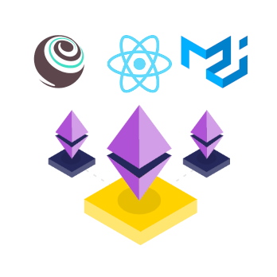

<h1 align="center">React + Material-UI + Truffle Box</h1> <br>
<p align="center">
  
</p>
<p align="center">Rapid Ethereum Dapp Development</p>

<p align="center">
  
  
  
  
  
  
</p>

---

This box contains everything you need to get started using smart contracts from a Rect app with the Material-ui library.

## Installation

First, create a new empty directory and go to it.

1. Run the `unbox` command via `npx` and skip to step 3. This will install all necessary dependencies. A React app is generated a the `root` of the directory.
   ```js
   npx truffle unbox truffle-react-material
   ```

2. Alternatively, you can install Truffle globally and run the `unbox` command.
    ```javascript
    npm install -g truffle
    truffle unbox truffle-react-material
    ```

3. Run the development console.
    ```javascript
    truffle develop
    ```

4. Compile and migrate the smart contracts. Note inside the development console we don't preface commands with `truffle`.
    ```javascript
    compile
    migrate
    ```
    If you want to migrate your smart contract with a fresh blockchain state, you can run the command below.
     ```javascript
    truffle migrate --reset
    ```
    The `--reset` flag purge the blockchain state. Don't run the command with this flag in production unless you know what you are doing.

5. In the `root` directory, we run the React app. Smart contract changes must be manually recompiled and migrated.
    ```javascript
    // in another terminal (i.e. not in the truffle develop prompt)
    npm run start
    ```

6. Truffle can run tests written in Solidity or JavaScript against your smart contracts. Note the command varies slightly if you're in or outside of the development console.
    ```javascript
    // inside the development console.
    test

    // outside the development console..
    truffle test
    ```

7.  For testing React components with Jest, you can install it as dev dependency. Compile your contracts before running Jest, or you may receive some file not found errors.
    ```javascript
    // ensure you are inside the client directory when running this
    npm install --save-dev @testing-library/react

    npm run test
    ```

8. To build the application for production, use the build script. A production build will be in the `dist/` folder.
    ```javascript
    // ensure you are inside the client directory when running this
    npm run build
    ```

## FAQ

* __How do I use this with the Ganache-CLI?__

    It's as easy as modifying the config file! [Check out our documentation on adding network configurations](http://truffleframework.com/docs/advanced/configuration#networks). Depending on the port you're using, you'll need to update line 12 of `src/lib/Web3Context.js`. You'll also need to update the line 10 of `src/lib/MyContractContext.js` depending your network id.

* __Where is my production build?__

    The production build will be in the `dist/` folder after running `npm run build` in the `root` folder.

* __Where can I find more documentation?__

    This box is a marriage of [Truffle](http://truffleframework.com/) and a React setup created with [React](https://fr.reactjs.org/). Either one would be a great place to start!

    This box is composed of [Truffle](http://truffleframework.com/), [React](https://fr.reactjs.org/), [Material-UI](https://material-ui.com/), [Webpack 5](https://webpack.js.org/) and [Babel 7](https://babeljs.io/)

    You can also find amazing royalty free illustrations on [Manypixels](http://manypixels.co/gallery)

## Extra

    😊 Do you like this box? Buy me a coffee

* Btc address: `1A2VNHSLGDyYsKWniJBe8cCqYWC52NvNZx`

* Eth address: `0xFe444a01D9494Ec04f61797e15193C8016D666A5`
